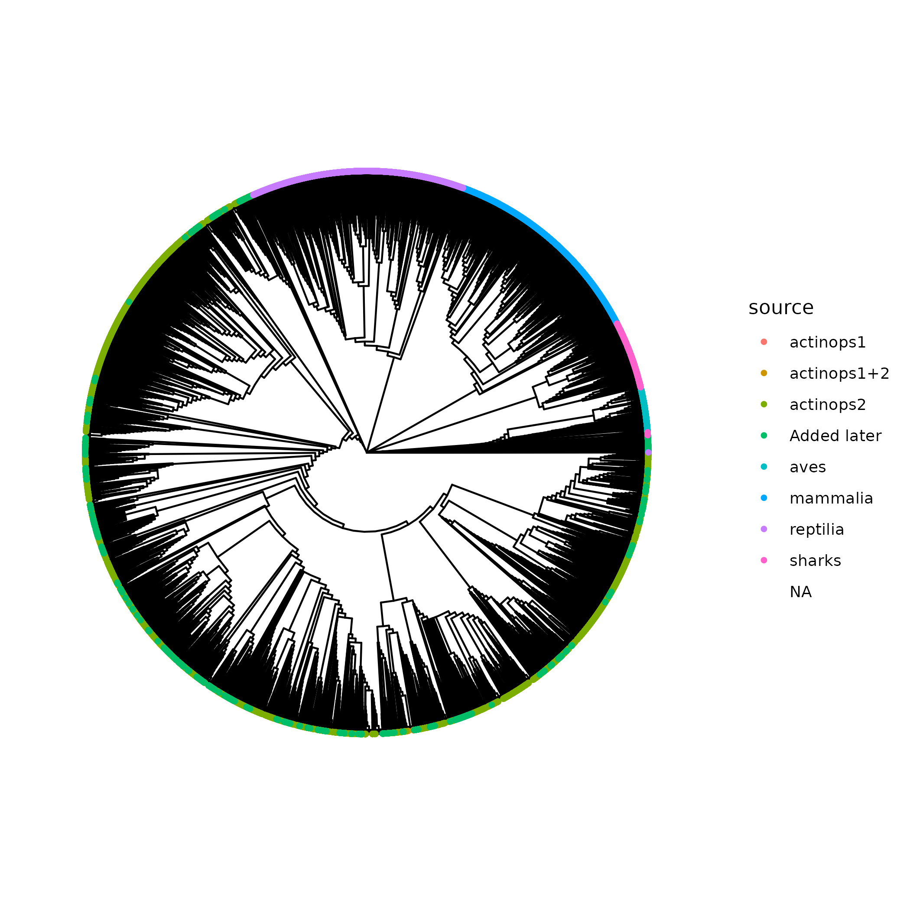

# OceanOmics 'super tree'

For visualisation purposes we need a large tree that contains all marine vertebrates. For subsequent publications, presentations, 
visualisations etc. we can then always 'just' subset that large tree.

This repository contains code that pulls in several public trees, 
merges them, 
and then treats that large tree as a backbone to insert, at the genus-level, species we do not have in the phylogeny but are marine vertebrates.

For species for which we do not have a genus in the backbone tree, the above method does not place them.
But we have the families! so what we do is calculate the MRCA of all members of the family and place the species at the root of that tree with the maximum branch length.



# Caveats

- The branch lengths in the merged tree are meaningless as the contributing trees do things differently.

- The marine vertebrates not in the tree are placed into their genus (see [here](https://cran.r-project.org/web/packages/RRphylo/vignettes/Tree-Manipulation.html) for the method),
so their placement is a bit random within the genus, and obviously their branch length is extra-meaningless. The ones added via the family MRCA alone are even iffier.

# Files

*Master Species List - Marine Vertebrates.xlsx* - an OceanOmics-internal curated list of marine vertebrate species. We place all of these in the phylogeny.

*big_tree.Actinopterygii.Chondrichtyes.tre* - all trees (see below) merged into a supertree using superTree MRP. Of the three trees in this repository, this is the most 'trustworthy' one. This tree has 10,938 tips.

*big_tree.withGeneraAdded.tre* - the above tree with as many marine vertebrates added as possible using [RRphylo tree.merger](https://cran.r-project.org/web/packages/RRphylo/vignettes/Tree-Manipulation.html).
Where Genus was not present in the tree, the species was not added. This tree has 31,277 tips.

*big_tree.withGeneraAdded.andFamilies.tre* - the above tree, but with missing species without genera in the tree added at family-level MRCA for species that were not in the tree.
Of the three trees, this is the least 'trustworthy' one. This tree has 34,916 tips.

You can see that some of these species were added at the root of the entire tree:


*.Renviron* - this changes the download SSL package to use openSSL to work with our internal VPN.

Other files ending in *tre - all public phylogenies from the below papers.

*mergeTrees.qmd* - the quarto report with all code.

# To subset

```
# load the tree
t_big <- ape::read.tree("big_tree.withGeneraAdded.andFamilies.tre")

# make sure your list of species has _ in their names instead of spaces
your_list_of_species <- gsub(' ', '_', all_species)

# check which of those species are in the tree
species_in_tree <- intersect(species_to_keep, t_big$tip.label)

# and subset the tree
t2 <- ape::keep.tip(t_big, species_in_tree)

# and plot!
ggtree(t2)
```

# Data Sources/Citations

Actinopterygii: *Betancur-R, R., Wiley, E.O., Arratia, G. et al. Phylogenetic classification of bony fishes. BMC Evol Biol 17, 162 (2017).* https://doi.org/10.1186/s12862-017-0958-3 Additional File 2

Actinopterygii, second tree: via the fishtreeoflife *R package, Chang J, Rabosky DL, Smith SA, Alfaro ME (2019). “An R package and online resource for macroevolutionary studies using the ray-finned fish tree of life.” Methods in Ecology and Evolution, 10(7), 1118-1124. ISSN 2041-210X, doi:10.1111/2041-210x.13182.*

*Rabosky DL, Chang J, Title PO, Cowman PF, Sallan L, Friedman M, Kaschner K, Garilao C, Near TJ, Coll M, Alfaro ME (2018). “An inverse latitudinal gradient in speciation rate for marine fishes.” Nature, 559(7714), 392-395. doi:10.1038/s41586-018-0273-1.*

Chondrichtyes: *Global priorities for conserving the evolutionary history of sharks, rays, and chimaeras R.W. Stein, C.G. Mull, T.S. Kuhn, N.C. Aschliman, L.N.K. Davidson, J.B. Joy, G.J. Smith, N.K. Dulvy, A.O. Mooers Nature Ecolgy and Evolution, 2.*
from https://vertlife.org/sharktree/downloads/ 610.tree.10Cal.RAxML.BS.nex
 
Aves: *Stiller, J., Feng, S., Chowdhury, AA. et al. Complexity of avian evolution revealed by family-level genomes. Nature 629, 851–860 (2024). https://doi.org/10.1038/s41586-024-07323-1*

DOI leads to : https://erda.ku.dk/archives/341f72708302f1d0c461ad616e783b86/published-archive.html

Using this file: https://erda.ku.dk/archives/341f72708302f1d0c461ad616e783b86/B10K/data_upload/03_species_trees/63K.tre


(Marine) Mammalia: All mammal tree from *Upham NS, Esselstyn JA, Jetz W (2019) Inferring the mammal tree: Species-level sets of phylogenies for questions in ecology, evolution, and conservation. PLOS Biology 17(12): e3000494. https://doi.org/10.1371/journal.pbio.3000494*

Specifically Data S3, `RAxML_bipartitions.result_FIN4_raw_rooted_wBoots_4098mam1out_OK.newick`, in 
https://datadryad.org/downloads/file_stream/188724

Reptiles (seasnake): *Pyron, R.A., Burbrink, F.T. & Wiens, J.J. A phylogeny and revised classification of Squamata, including 4161 species of lizards and snakes. BMC Evol Biol 13, 93 (2013). https://doi.org/10.1186/1471-2148-13-93*

https://bmcecolevol.biomedcentral.com/articles/10.1186/1471-2148-13-93#Sec29

Additional file 1: Data File S1:

As some of these trees have no species connecting them with other trees, we used this previous supertree as a starting point: *Uyeda, J. C., Pennell, M. W., Miller, E. T., Maia, R., & McClain, C. R. (2017). The evolution of energetic scaling across the vertebrate tree of life. The American Naturalist, 190(2), 185-199.* https://www.journals.uchicago.edu/doi/10.1086/692326